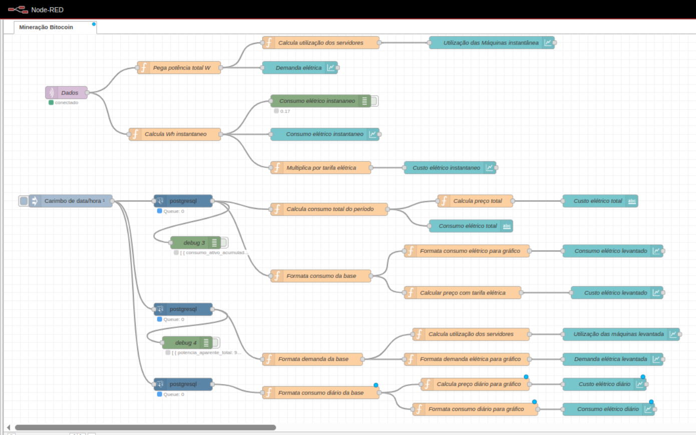
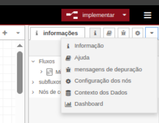
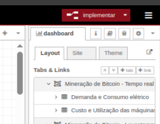
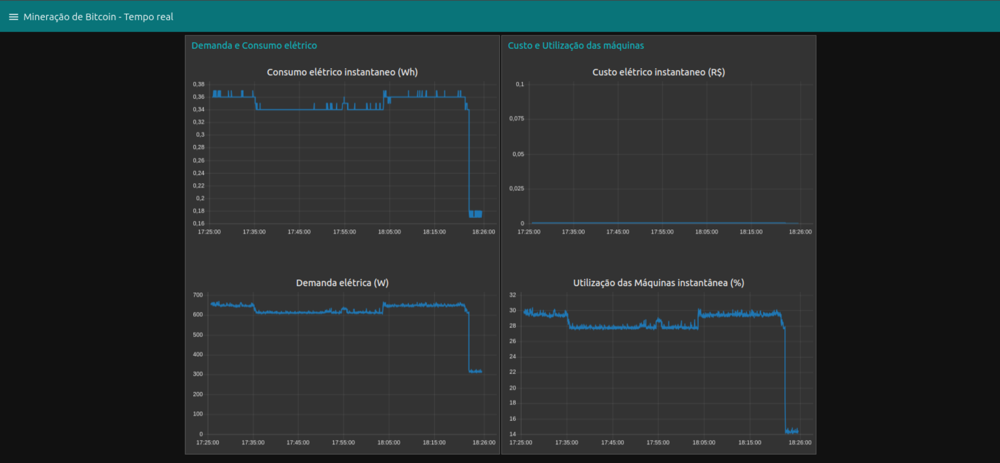
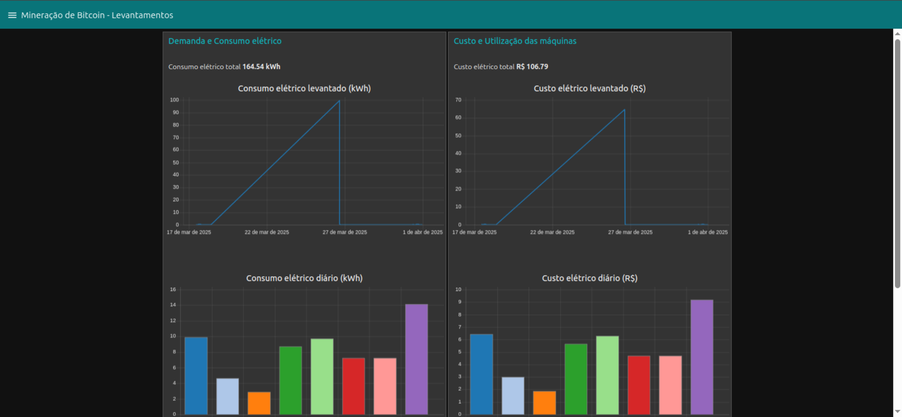
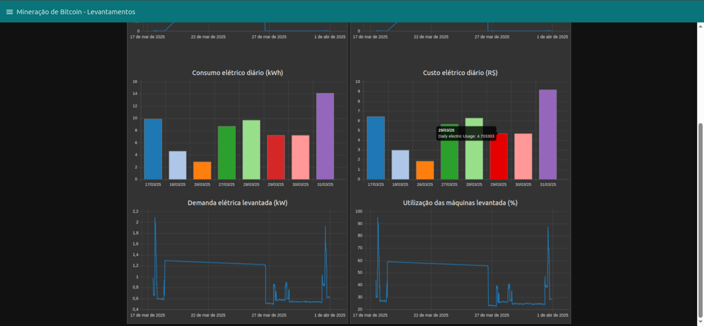

# Projeto PCS3819

## Descrição

Este projeto implementa fluxos no Node-RED para o controle de consumo de energia de uma empresa de mineração de bitcoins.

## Pré-requisitos

- Node.js (https://nodejs.org/pt/download)

## Instalação

1. Clone este repositório

2. Instale as dependências necessárias:

```bash
npm install
```

## Configuração

1. Importe o arquivo de fluxos no Node-RED:

- Execute o Node-Red:

```bash
npx node-red
```

- Abra o Node-RED no navegador (geralmente em `http://localhost:1880`)
- Menu → Import → Selecione o arquivo `flows.json`
- Clique em Import
- Após a importação será possível ver o seguinte fluxo:
  

2. Configure as conexões com o broker mqtt e com o banco de dados:

- No nó de dados verifique os seguintes dados de conexão com o broker mqtt:

```
Broker MQTT V3.1.1
IP: 143.107.102.8
Port: 1883
Username: automacao-2025
Senha: auto835192
Tópico: garsoft/dev/je05/dados
Sem TLS.
```

- Nos nós de conexão com banco de dados verifique os seguintes parâmetros:

```
host: 143.107.102.8
porta: 5432
database: data-energia
usuário: leitor
senha: garsoftData2024
```

3. Implantação:

Após realizar as configurações basta clicar em `implementar` no canto superior esquerdo.

Para acessar os dashboards vá em dashboards e clique no ícone logo abaixo da seta.




## Dashboards




